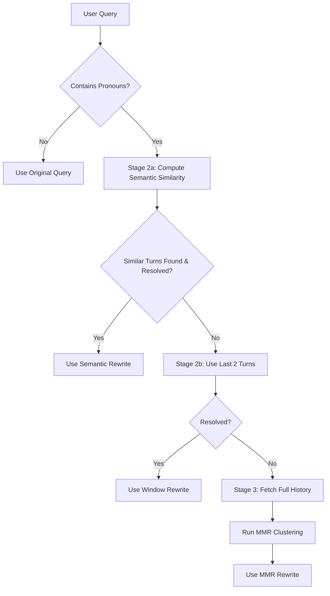

# Proposal: Progressive Context with Conditional MMR

This document outlines a new retrieval strategy designed to address the limitations of the current "always-on" MMR Clustering approach. The core concept is **Progressive Context Escalation**: attempting to resolve queries with minimal context first, and only escalating to full-history MMR clustering when necessary.

## Experimental Evidence & Motivation

Our analysis of the MMR Clustering strategy (k=10, λ=0.7) revealed specific inefficiencies that this proposal aims to solve.

### 1. The "Turn 1" Inefficiency
*   **Statistic**: At Turn 1, "Last Turn" (no context) and "Query Rewrite" achieve identical performance (e.g., ClapNQ R@5: **0.8482** for both).
*   **Problem**: Running MMR clustering on Turn 1 or simple follow-ups is computational waste.

### 1b. The "No-OPeration Rewrite" Problem
*   **Statistic**: **125 cases (14.8% of Turn 2+ queries)** result in rewritten queries that are **identical** to the original query, even after full MMR clustering pipeline processing.
*   **Domain Breakdown**:
    *   Cloud: **41 cases (32.7% of domain)**
    *   FiQA: **32 cases (29.6% of domain)**
    *   ClapNQ: **26 cases (24.6% of domain)**
    *   Govt: **26 cases (25.2% of domain)**
*   **Examples**:
    *   Cloud Turn 2: "What is Red Hat OpenShift?" → Rewritten: "What is Red Hat OpenShift?" (after extracting 4 sentences, selecting 4)
    *   FiQA Turn 4: "Why do municipalities issue bonds?" → Rewritten: "Why do municipalities issue bonds?" (after extracting 31 sentences, selecting 10)
    *   Govt Turn 5: "What causes wildfires?" → Rewritten: "What causes wildfires?" (after extracting 24 sentences, selecting 10)
*   **Problem**: These queries are already standalone, but the system still processes full conversation history (extracting 4-53 sentences, clustering, MMR selection) only to produce the same query.

### 2. Performance Degradation in Short-Context Domains
*   **Statistic**: In the **Cloud** domain, MMR Clustering (R@5 **0.4092**) actually performs *worse* than the simple "Last Turn" baseline (R@5 **0.4201**).
*   **Example** (Real case from Cloud domain):
    *   *Task*: `47b2471404382af6e973013ab1cf96b9<::>8` (Turn 8)
    *   *Original Query*: "Enterprise" (short keyword query)
    *   *Last Turn Performance*: NDCG@5 = **1.0000** (perfect retrieval)
    *   *MMR Behavior*: Extracted 38 sentences from history, selected 10 via clustering, rewrote to "I want to know about creating an Enterprise account in IBM Cloud."
    *   *MMR Performance*: NDCG@5 = **0.3869** (62% worse than Last Turn)
    *   **Problem**: The short keyword "Enterprise" was already effective for retrieval, but MMR over-expanded it by injecting context, diluting the query's precision.

### 3. Aggressive Filtering vs. Query Quality
*   **Statistic**: By Turn 12, MMR filters out **91.2%** of extracted sentences.
*   **Statistic**: Despite this filtering, MMR still underperforms the standard Query Rewrite baseline by **2-5%** across all metrics (e.g., Overall NDCG@10: **0.4710** vs **0.4953**).
*   **Interpretation**: The diversity-focused selection (MMR) sometimes discards the *specific* relevant detail needed for a rewrite in favor of broad topic coverage.
*   **Solution**: **Stage 2 (Expert-Based Selection)** uses two complementary approaches: semantic similarity to find relevant distant turns, and a local window fallback to capture immediate conversational dependencies, before escalating to full history.

### 4. Domain-Specific Needs
*   **Statistic**: **Govt** domain benefits from MMR (R@5 **0.5052** vs Last Turn **0.4449**), while **Cloud** is hurt by it.
*   **Solution**: **Stage 3 (Escalation)** is naturally triggered more often in complex domains like Govt (with deeper references) and less often in Cloud (transactional queries), automatically adapting to domain needs.

---

## The Proposed Solution: 3-Stage Workflow (with Expert Sub-Stages)

Instead of a "one-size-fits-all" pipeline, we propose a conditional workflow that escalates based on ambiguity.

### Stage 1: Fast Standalone Check (Heuristic)

Before doing any expensive processing, check if the user's query is likely standalone.

*   **Logic**: Check for specific linguistic markers indicating dependency.
    *   **Pronouns**: `he`, `she`, `it`, `they`, `this`, `that`, `those`, `these`.
    *   **Explicit Referencing**: "the previous", "the former", "as mentioned".
    *   **Length/Structure**: Very short queries (< 5 words) often imply context dependence.
*   **Action**:
    *   **No markers found**: Treat as **Standalone**. Skip rewriting and retrieval. Use `Last Turn` query directly.
    *   **Markers found**: Proceed to Stage 2.

### Stage 2: Expert-Based Context Selection (Two Sub-Stages)

We use a two-stage expert approach to select relevant context, trying semantic similarity first, then falling back to a local window.

#### Stage 2a: Semantic Similarity-Based Selection

Use **semantic similarity** to adaptively select relevant turns from throughout the conversation history:

*   **Logic**:
    1.  Embed the current question using BGE (`BAAI/bge-base-en-v1.5` - already used in MMR pipeline).
    2.  Embed all previous user questions from conversation history.
    3.  Compute cosine similarity between current question and each previous question.
    4.  Select turns where similarity exceeds a threshold (e.g., >= 0.7) OR select top-k most similar turns (e.g., top 3-5).
    5.  For each selected turn, include:
        *   The user question from that turn
        *   The agent response from that turn
    6.  Perform **Query Rewrite** using this semantically-selected context.
    7.  **Ambiguity Check**: Ask the LLM if the rewritten query is fully disambiguated.
*   **Action**:
    *   **Resolved**: Use the rewritten query. Stop.
    *   **Still Ambiguous** OR **No similar turns found**: Proceed to Stage 2b.

**Advantages**:
*   **Adaptive**: Only selects turns relevant to current question, not just recent ones
*   **Handles Topic Shifts**: Won't include irrelevant recent turns if conversation shifted topics
*   **Finds Distant References**: Can connect Turn 1 and Turn 7 if they're semantically similar
*   **Efficient**: Uses existing BGE infrastructure, O(n) similarity computation is fast for typical conversation lengths

#### Stage 2b: Smart Window Fallback (Last 2 Turns)

If semantic similarity didn't resolve the query, fall back to a simple local window approach:

*   **Logic**:
    1.  Select **Last 2 Turns** of context (User Turn N-1 + Agent Response N-1 + User Turn N-2 + Agent Response N-2).
    2.  Perform **Query Rewrite** using this local window.
    3.  **Ambiguity Check**: Ask the LLM if the rewritten query is fully disambiguated.
*   **Action**:
    *   **Resolved**: Use the rewritten query. Stop.
    *   **Still Ambiguous**: Proceed to Stage 3.

**Rationale**: Many conversational references (pronouns, "the previous", etc.) refer to immediate context. This fallback ensures we capture these local dependencies even when semantic similarity doesn't find matches.

### Stage 3: Conditional MMR Escalation (Global Context)

If local context failed to resolve the query (e.g., "What about the first thing we discussed?"), we escalate to the heavy-duty global context search.

*   **Logic**:
    1.  Fetch **Full Conversation History**.
    2.  Apply **MMR Clustering** (k=10, λ=0.7/0.3 based on domain) to select diverse, relevant sentences from the distant history.
    3.  **Final Rewrite**: Rewrite the query using the MMR-selected context.
*   **Action**: Use the MMR-rewritten query for retrieval.

## Flowchart Logic

## Expected Benefits

1.  **Reduced Latency**: 
    *   **14.8% of Turn 2+ queries** are already standalone (no-op rewrites), which Stage 1 would catch immediately.
    *   An additional **~50-60%** of turns will likely be resolved in Stage 2a or 2b (semantic similarity or local window), avoiding the expensive clustering step.
    *   **Total**: ~65-75% of all turns avoid full-history MMR processing.
    *   **Semantic similarity computation** is fast (O(n) for n previous questions, typically < 10 turns) compared to full MMR clustering pipeline.
2.  **Improved Precision**: By not forcing history into standalone questions (Turn 1, topic shifts), we reduce "hallucinated" context and noise.
3.  **Targeted Power**: MMR is reserved for the hard cases (distant references) where it actually shines, rather than being diluted by easy cases.
4.  **Domain Adaptability**:
    *   **Cloud/FiQA**: Will likely stay in Stage 1/2 (short, distinct queries with clear semantic boundaries).
    *   **ClapNQ/Govt**: Will escalate to Stage 3 when complex entity tracking or multiple overlapping topics require full-history MMR clustering.
5.  **Better Context Selection**: 
    *   **Stage 2a (Semantic Similarity)**: Ensures only relevant turns are included, avoiding noise from recent but irrelevant turns (e.g., topic shifts).
    *   **Stage 2b (Local Window)**: Captures immediate conversational dependencies (pronouns, "the previous") that semantic similarity might miss.
6.  **Expert System Design**: Two complementary approaches (semantic vs. local) increase the chance of resolving queries before expensive full-history processing.
